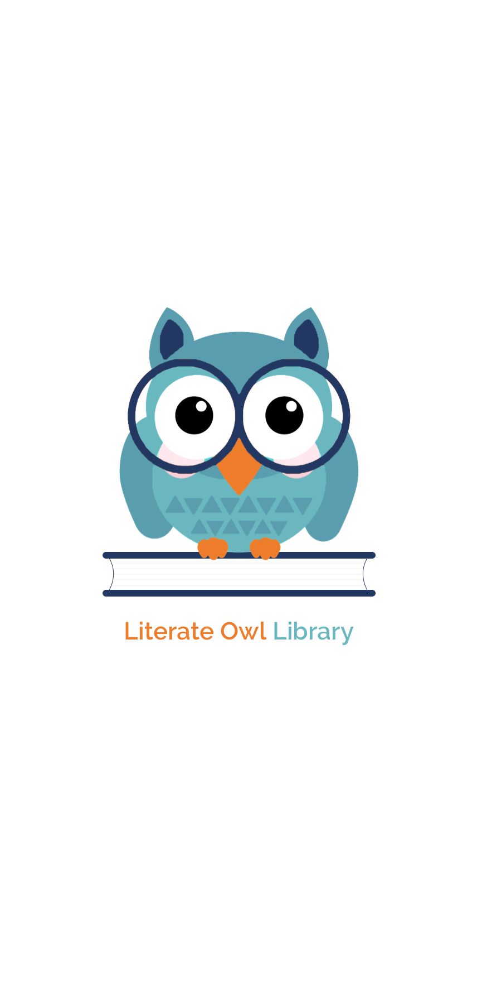
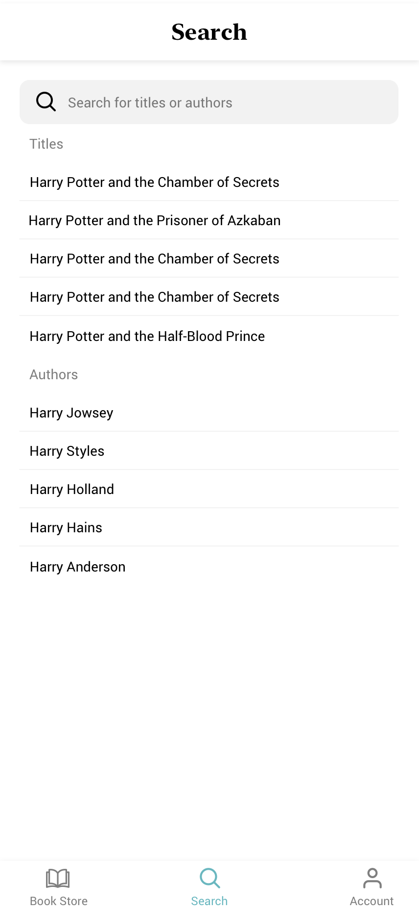

[![linkedin][linkedin-shield]][linkedin-url]

# Literate Owl Library - Online Book Shop

Welcome to the Literate Owl Library, your go-to destination for all things books! This mobile application is designed to provide users with an immersive online book shopping experience. Whether you're searching for a specific title, browsing by category, or looking to discover new reads, the Literate Owl Library has you covered.

# Screenshots

  
    
    
    
    
    
    
    

## Features
- **User Authentication:** Users can sign up or log in to their accounts securely with JWT authentication.
- **Search and Browse:** Easily search for specific titles or browse through various categories to discover new reads.
- **Book Details:** Access detailed information about each book, including synopsis, author details, and user ratings.
- **Bookmarking:** Save your favorite books for easy access later and create personalized reading lists.
- **Purchase:** Seamlessly purchase books directly from the app and enjoy hassle-free checkout.
- **Profile Management:** Edit your profile information, track your order history, and manage your preferences with ease.

## Technologies Used
### Client Side
- React Native: 0.62.2
- React Navigation: 5.6.1
- React Redux: 7.2.0
- Redux: 4.0.5
- Redux Thunk: 2.3.0

### Server Side
- Node.js: ^12.x
- Express.js: 4.17.1
- JWT Authentication: 8.5.1
- Redis (for token storage and caching): 3.0.2
- ElasticSearch (as a database for storing books and user information): 7.6.1
### Data Source
- **Goodreads Dataset:** The application utilizes a dataset obtained from Kaggle, which was originally gathered from Goodreads. This dataset contains information on over 10,000 books, including titles, authors, ratings, and more. You can find the dataset [here][kaggle-url].

## Installation
1. Clone the repository to your local machine.
2. Navigate to the project directory.
3. Install dependencies using `npm install` or `yarn install`.
4. Configure your environment variables for the server (e.g., database connection, JWT secret).
5. Run the server using `npm start` or `yarn start`.
6. Run the client app on an iOS or Android emulator using `npx react-native run-ios` or `npx react-native run-android`.

## Usage
1. Launch the app and sign up or log in to your account.
2. Browse books by searching or navigating through categories.
3. View detailed information about each book and add them to your bookmarks.
4. Purchase books directly from the app with a secure checkout process.
5. Manage your profile and account settings as needed.
6. Enjoy a seamless online book shopping experience!

## Contributing
Contributions to this project are welcome! If you'd like to contribute, please fork the repository and submit a pull request with your changes.

## Contact Me

#### Shervin Ghajar
- [Linkedin][linkedin-url]
- Gmail: ssghajar.work@gmail.com

## License
This project is licensed under the [MIT License](/LICENSE).

(<a href="#readme-top">back to top</a>)

<!-- MARKDOWN LINKS & IMAGES -->
[kaggle-url]: https://www.kaggle.com/datasets/jealousleopard/goodreadsbooks

[linkedin-shield]: https://img.shields.io/badge/Linkedin-0A66C2?style=for-the-badge&logo=linkedin&logoColor=white
[linkedin-url]: https://www.linkedin.com/in/shervin-ghajar-254258180/

[gmail-shield]: https://shields.io/badge/Gmail-white?logo=gmail
[gmail-url]: ssghajar.work@gmail.com
